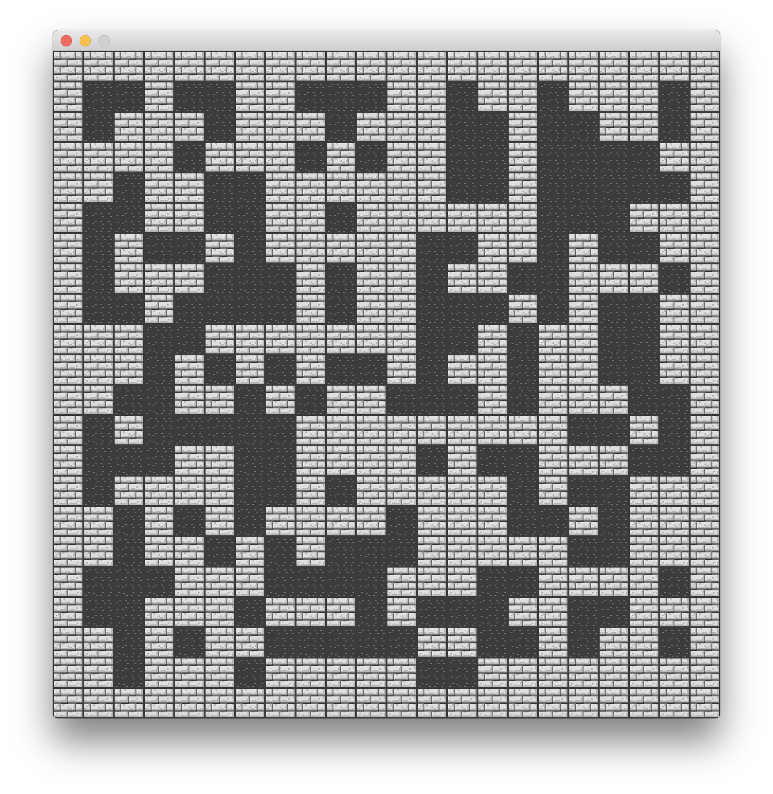

# Level Generation for a Tile-Based Game
**Benedict Henshaw**
BSc Games Programming, Year 3
Game AI Programming

## Overview
This project is a demonstration of several level generation techniques for a simple tile-based game.

The game is turn-based. The player must find the key to unlock the exit, and then enter the exit itself to win. The player can also kill enemies and collect gold along the way. It is modelled roughly after the game Rogue (~1980).

The level generator has several techniques implemented in it; some can be used together. In general, there are three major stages involved: placing walls, placing entities that have no strict requirements, and placing objective critical entities.


## Technical Description

### The Level
A `Level` is a grid of `Tile`s. A `Tile` is a bit field, two bytes (16 bits) long. Each `Tile` can hold one of each entity, such as `WALL` or `GOLD`. There is a corresponding bit in each `Tile` for every entity type. To place an entity onto a `Tile`, all one needs to do is set its corresponding bit to `1`. As there are nine entity types in the game, nine bits are needed to store this data in each `Tile`. Two bytes is the smallest number of bytes that will hold at least nine bits, that is why a `Tile` is two bytes long.

Entities are defined as constant integers, with each entity having a value one higher than the previous.

```C
#define FLOOR  1
#define WALL   2
#define SPIKES 3
#define EXIT   4
#define LOCK   5
#define GOLD   6
#define KEY    7
#define ENEMY  8
#define PLAYER 9
```


Here is how one places an entity onto a `Tile`, for example a `KEY`:

```C
tile |= BIT(KEY);
```

Here is how to remove that entity:

```C
tile &= ~BIT(KEY);
```

And how to toggle an entity without regard for its current state:

```C
tile ^= BIT(WALL);
```

One can also express the existence of multiple entities at once:

```C
BIT(FLOOR) | BIT(GOLD) | BIT(SPIKES)
```

Check if an `Tile` has an entity on it:

```C
if (tile & BIT(GOLD)) { ... }
```

Or if it doesn't have a certain entity on it:

```C
if (tile & BIT(GOLD) == 0) { ... }
```

The macro `BIT()` is simply a way of selecting that bit:

```C
#define BIT(n) (1 << (n))

// Examples
// BIT(0) -> 00000001
// BIT(1) -> 00000010
// BIT(4) -> 00010000
```

A `Level` is an one-dimensional array of `Tile`s, but is still used to hold 2D data. To access any (x, y) position in the level one needs to use a simple equation:

```C
// x + y * width
Tile tile = level[x + y * LEVEL_SIZE];
```

### Generating Levels
Before constructing any level generation methods, I decided on some rules that must be followed.

Every level will:

+ Have a border of walls.
+ Have one exit, which will have a lock on it.
+ Have one key, which will remove the lock.
+ Be square (with its side length is declared as the constant `LEVEL_SIZE`).

All levels should be completable; an obvious but important constraint of a level generator. In order to complete a level, the player must find the key to unlock the exit, and then enter the exit itself. I decided that this two-stage goal would be better than a simple 'find the exit' mechanic, as the level generator has to be a tiny bit smarter to generate valid levels.


#### The Most Basic Approach
When I began trying to tackle the problem of level generation, my first instinct was to use a random number generator to simply scatter things about in the level. I had my rules about which entities must be in the level, but other things, like walls, enemies and gold had some flexibility.

Here is the code for my most basic approach to placing floor (walk-able) tiles:

```C
// A very rough number that will decide what portion of the level is floor.
float portion_of_level_to_be_floor = 0.5f;

int floor_count = portion_of_level_to_be_floor * (LEVEL_SIZE * LEVEL_SIZE);

// Start with just walls.
fill_level(level, WALL);

// Scatter some floor around the level.
for (int i = 0; i < floor_count; ++i) {
    int x = random_int_range(1, LEVEL_SIZE-2);
    int y = random_int_range(1, LEVEL_SIZE-2);
    level[x + y * LEVEL_SIZE] = BIT(FLOOR);
}
```



Once we have walls in place, a similar approach can be taken for placing other entities in the level.

```C
// Scatter some entities around by visiting every tile.
for (int y = 1; y < LEVEL_SIZE-1; ++y) {
    for (int x = 1; x < LEVEL_SIZE-1; ++x) {
        Tile t = level[x + y * LEVEL_SIZE];

        // If it is not a wall, there is a chance to place some entities.
        if ((t & BIT(WALL)) == 0) {
            if (chance(0.07f)) t |= BIT(GOLD);   else
            if (chance(0.03f)) t |= BIT(ENEMY);  else
            if (chance(0.03f)) t |= BIT(SPIKES);
        }

        level[x + y * LEVEL_SIZE] = t;
    }
}

int x, y;

// Place the locked door.
do {
    x = random_int_range(1, LEVEL_SIZE-1);
    y = random_int_range(1, LEVEL_SIZE-1);
} while ((level[x + y * LEVEL_SIZE] != BIT(FLOOR)));
level[x + y * LEVEL_SIZE] = BIT(FLOOR) | BIT(EXIT) | BIT(LOCK);

// Place the key.
do {
    x = random_int_range(1, LEVEL_SIZE-1);
    y = random_int_range(1, LEVEL_SIZE-1);
} while ((level[x + y * LEVEL_SIZE] != BIT(FLOOR)));
level[x + y * LEVEL_SIZE] = BIT(FLOOR) | BIT(KEY);

// Place the player.
do {
    x = random_int_range(1, LEVEL_SIZE-1);
    y = random_int_range(1, LEVEL_SIZE-1);
} while ((level[x + y * LEVEL_SIZE] != BIT(FLOOR)));
level[x + y * LEVEL_SIZE] = BIT(FLOOR) | BIT(PLAYER);
```


As you can see, I have taken a few precautions when placing entities to make sure that only tiles that are not walls are selected. These checks alone will not do much to guarantee a generated level is completable.

#### The Digger
One way to generate a level that is guaranteed to be is completable is by using an agent to perform a random walk, carving out walk-able space in the level as it moves. If objective critical entities, including the player, are all placed into the carved out space, one can be sure that they are all accessible, and therefore the level is completable (assuming that no other obstacles have been added). I learned of this method in Chapter 3 of The PCG Book (http://pcgbook.com/).

Here is my initial implementation of this. Some parameters are defined at the top which can be used to control the level generation.

```C
float turn_chance_step = 0.01f;
float ideal_walkable_portion = 0.2f;
float turn_chance = turn_chance_step;

int digger_x = random_int_range(1, LEVEL_SIZE-1);
int digger_y = random_int_range(1, LEVEL_SIZE-1);

enum { UP = 1, DOWN, LEFT, RIGHT };
int direction = random_int_range(1, 4);

int floor_count = ideal_walkable_portion * (LEVEL_SIZE * LEVEL_SIZE);

for (int i = 0; i < floor_count; ++i) {
    // Set this tile to floor.
    level[digger_x + digger_y * LEVEL_SIZE] = BIT(FLOOR);

    // Now step to the next tile.
    if (direction == UP)    --digger_y; else
    if (direction == DOWN)  ++digger_y; else
    if (direction == LEFT)  --digger_x; else
    if (direction == RIGHT) ++digger_x;

    // Keep the digger within the outer wall.
    digger_x = CLAMP(1, digger_x, LEVEL_SIZE-2);
    digger_y = CLAMP(1, digger_y, LEVEL_SIZE-2);

    // There is a chance that the digger will turn a random direction.
    if (chance(turn_chance)) direction = random_int_range(1, 4);
    else turn_chance += turn_chance_step;
}
```


One can now use the same method as before to scatter entities around the level to produce a level that is almost guaranteed to be completable. Almost, as this scattering introduces spikes, and spikes are effectively not traversable as the player loses when they step onto them. It seems that what we really need is a way to verify, with complete confidence, that a level is completable.

#### Verifying Levels
Knowing the goals of the game, in order to verify that a level is completable we need to answer the question 'Is it possible for the player reach the key and the exit?'. We need to find a way to check if a valid path exists between the player, the key, and the exit.

Most games programmers will read this and think, 'Just use A\* to find a path'. I had the same thought, but after briefly assessing the problem I decided that a much simpler method would be acceptable (and more versatile): flood fill.

```C
typedef bool (*Flood_Func)(Tile *, int x, int y, void *);

int flood(Level level, int start_x, int start_y, Tile mask, Tile target, Flood_Func func, void * data) {
    enum { TODO = 1, DONE = 2 };
    u8 todo[LEVEL_SIZE * LEVEL_SIZE] = {0};
    int steps_taken = 0;

    todo[start_x + start_y * LEVEL_SIZE] = TODO;

    // This loop could be unbounded, but there is a known maximum which is
    // visiting every single tile in the level.
    for (int i = 0; i < LEVEL_SIZE * LEVEL_SIZE; ++i) {
        // If a whole iteration takes place and no tiles marked TODO are found,
        // then we know that the flood is finished.
        bool cleared_todo = true;

        for (int y = 0; y < LEVEL_SIZE; ++y) {
            for (int x = 0; x < LEVEL_SIZE; ++x) {
                if (todo[x + y * LEVEL_SIZE] == TODO) {
                    // We found a tile marked TODO, so we are not finished.
                    cleared_todo = false;

                    // Check the masked bits of the tile, and see if they match the target bits.
                    if ((level[x + y * LEVEL_SIZE] & mask) == (target & mask)) {
                        bool stop = func(&level[x + y * LEVEL_SIZE], x, y, data);
                        if (stop) return steps_taken;

                        todo[x + y * LEVEL_SIZE] = DONE;

                        // Add the neighbouring tiles, if they have not already been checked.
                        if (x > 0 && todo[(x - 1) + y * LEVEL_SIZE] != DONE) {
                            todo[(x - 1) + y * LEVEL_SIZE] = TODO;
                        }
                        if (x < LEVEL_SIZE - 1 && todo[(x + 1) + y * LEVEL_SIZE] != DONE) {
                            todo[(x + 1) + y * LEVEL_SIZE] = TODO;
                        }
                        if (y > 0 && todo[x + (y - 1) * LEVEL_SIZE] != DONE) {
                            todo[x + (y - 1) * LEVEL_SIZE] = TODO;
                        }
                        if (y < LEVEL_SIZE - 1 && todo[x + (y + 1) * LEVEL_SIZE] != DONE) {
                            todo[x + (y + 1) * LEVEL_SIZE] = TODO;
                        }

                        ++steps_taken;
                    }
                }
            }
        }

        if (cleared_todo) break;
    }

    return steps_taken;
}
```

There is quite a lot going on here, but I will just explain the most important part: how to use it.

First of all, my flood fill works by starting at a given (x, y) position and spreading out in the four major directions (i.e. not diagonally). Every tile that is touched by the flood fill is passed into the function `func()`, which is given as an argument when calling `flood()`. This allows `flood()` to be used for all kinds of problems.

Of course, a flood fill that just spreads out regardless of the contents of the level is not very useful. When calling `flood()` one has to state what kinds of tiles they want to flood. The `mask` and `target` parameters allow this.

Lets say I wanted to only flood tiles that have a floor, but don't have gold on them:

```C
// The FLOOR and GOLD bits are set to 1.
mask = BIT(FLOOR) | BIT(GOLD);

// The FLOOR bit is set to 1, but the GOLD bit is left at 0.
target = BIT(FLOOR);
```

The `mask` parameter allows the caller to set which bits (entity types) they want to have queried, and the `target` parameter can be used to set what state those bits must be in. In combination, these parameters allow querying of 'off' bits as well as 'on' bits.

Using these tools, we can now write a system to answer our question 'Is the level completable?'. First of all, lets figure out what our flood query is.

Our flood fill should effectively simulate all steps the player could take from their starting position. Therefore, we should query entities that affect traversal: floors, walls, and spikes.

```C
mask = BIT(FLOOR) | BIT(WALL) | BIT(SPIKES);
```

But traversable tiles are those that have a floor, are not walls, and don't have spikes on them.

```C
target = BIT(FLOOR);
```

Now that we can flood all walk-able tiles, lets just record all the entities we encountered during our flood fill.

```C
bool flood_record_tiles(Tile * tile, int x, int y, void * data) {
    Tile * result = data;
    *result |= *tile;
    return false;
}
```

A `void *` can be used to pass arbitrary data in and out of our custom flood function. Here it is used to set the bits of an external variable so that we can look at them later.

Now, lets perform the flood:

```C
// This empty tile will be used to store the bits of the entities encountered.
Tile entities_seen = 0;

flood(level,
    player_y, player_y,
    BIT(FLOOR) | BIT(WALL) | BIT(SPIKES),
    BIT(FLOOR),
    flood_record_tiles, &entities_seen);

// Check that we encountered both the key and the exit during the flood.
bool completable = (entities_seen & (BIT(KEY) | BIT(EXIT))) == (BIT(KEY) | BIT(EXIT));
```

Now that we have a way to verify that a level is completable, we can use this in our level generator.

#### Using the Verifier
With the level verifier in my tool-belt, I decided to return to my most basic level generation technique; with a twist. The 'scatter' method produced very poor levels which were often in-completable. Here is how I managed to turn this method into a useful one:

```C
// Create an empty level.
empty_level(level);
// Scatter our entities in the level, including the player, key, and exit.
scatter_placer(level);

float portion_of_level_to_be_wall = 0.5f;
int wall_count = portion_of_level_to_be_wall * (LEVEL_SIZE * LEVEL_SIZE);
int attempts = 32;

for (int i = 0; i < wall_count; ++i) {
    int x, y;

    // Only attempt to place the wall a few times, as there
    // may not be any more valid locations left.
    for (int i = 0; i < attempts; ++i) {
        // Choose a location.
        x = random_int_range(1, LEVEL_SIZE-2);
        y = random_int_range(1, LEVEL_SIZE-2);

        // If it will overwrite the player, skip it.
        if (level[x + y * LEVEL_SIZE] & BIT(PLAYER)) continue;

        // Put the new wall into the level, but preserve other original bits.
        level[x + y * LEVEL_SIZE] |= BIT(WALL);

        // Test to see if it invalidates the level.
        if (!level_is_completable(level)) {
            // If it does, take it out.
            // Any other entities that were on this tile will remain.
            level[x + y * LEVEL_SIZE] ^= BIT(WALL);
        } else {
            // This is an acceptable place for a wall, so remove the old bits.
            level[x + y * LEVEL_SIZE] = BIT(WALL);

            // Continue on to the next wall tile.
            break;
        }
    }
}
```


The first thing to note is that now we are starting from a level with no walls that already has all of its entities in place; we will be adding walls instead of removing them. Secondly, in this version, every time we add a wall we check if this change broke the level. If it did, we take the wall out, but if it didn't we leave it in. Repeating this enough times will produce a level that has lots of complexity, but is guaranteed to be completable.

#### Combining Techniques, and other experiments.
Another very basic level generation method I tried was to throw some random rooms into the level. Essentially, it just draws rectangles out of floor tiles. It doesn't even try to make them not intersect.

```C
int count = 8;
int min_width = 2;
int max_width = 10;
int min_height = 2;
int max_height = 10;

for (int i = 0; i < count; ++i) {
    int center_x = random_int_range(1, LEVEL_SIZE - 1);
    int center_y = random_int_range(1, LEVEL_SIZE - 1);
    int width  = random_int_range(min_width, max_width);
    int height = random_int_range(min_height, max_height);
    int top_left_x = center_x - width / 2;
    int top_left_y = center_y - height / 2;

    for (int y = 0; y < height; ++y) {
        for (int x = 0 ; x < width; ++x) {
            int tx = top_left_x + x;
            int ty = top_left_y + y;
            tx = CLAMP(1, tx, LEVEL_SIZE-2);
            ty = CLAMP(1, ty, LEVEL_SIZE-2);
            level[tx + ty * LEVEL_SIZE] = BIT(FLOOR);
        }
    }
}
```


The original Rogue has rectangular rooms like this, but they are connected by corridors. The level generation technique used in Rogue produced a tree structure that can be used to create corridors. My basic room generator also needs corridors to connect its rooms, but no tree structure exists for it.

After building the 'verified scatter' level generator described in the previous section, I hypothesised that if one were to run enough iterations of the algorithm, the resulting level would be completely filled, leaving only a carved path that connects the player, key, and exit. I was correct.


I realised that these nice connecting paths could be used to create the corridors I needed. The results were quite good.


## Conclusion
I learned several important things during this coursework. Here are a few of them.

**Level verification is powerful.** The same way a fitness function can steer the complex workings of a neural network, a function that can verify the integrity of a level can be used in all kinds of imaginative ways.

**Flexible code can be very useful.** Once I had implemented the flood fill algorithm and found some nice ways to make it flexible, I discovered how many applications it had: level verification, statistical analysis, player visibility calculation, and more. I got a lot of use out of this simple little function.

**The level data structure can define the game.** This is tangentially related to the level generation, but as I developed the data structure I was working with a set of predefined constraints. I wanted all the game state to exist in the tiles themselves. I also wanted to be able to read and write level data from disk easily; even pipe it between programs. The data structure I came up with solved these problems, but it also rigidly clamped in the possibility space for the design of the game.

Overall, I am pleased with the results. I found some ways to generate levels that are complex and interesting, often with surprising geometry. The techniques are also all rather fast, and could easily be used at runtime in a game.
